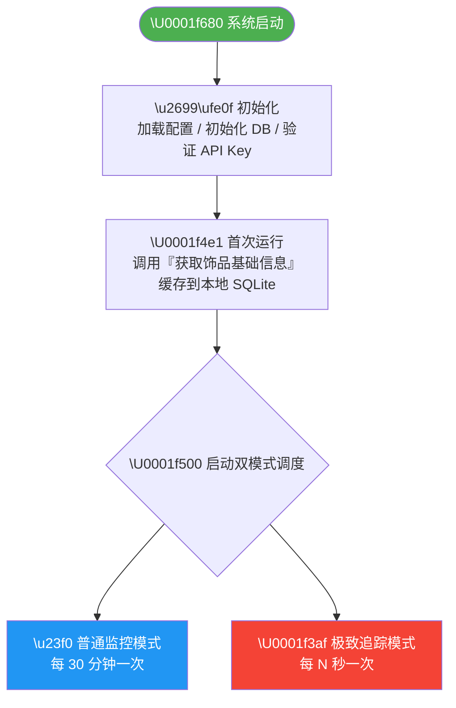
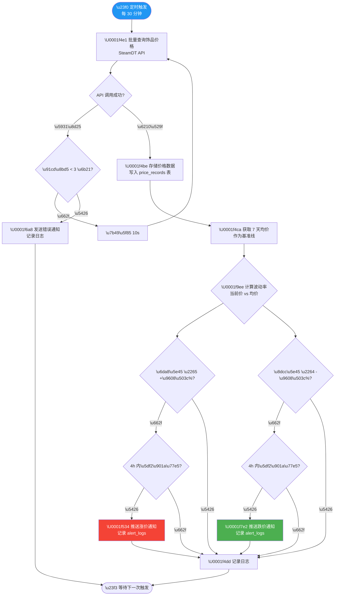
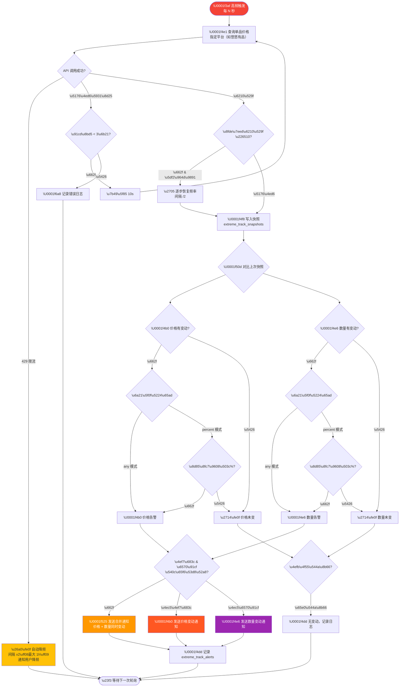
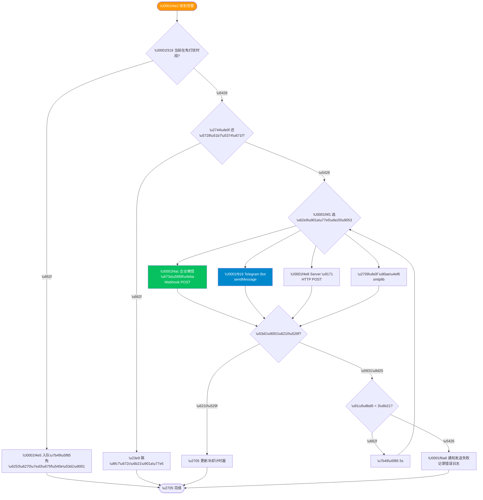
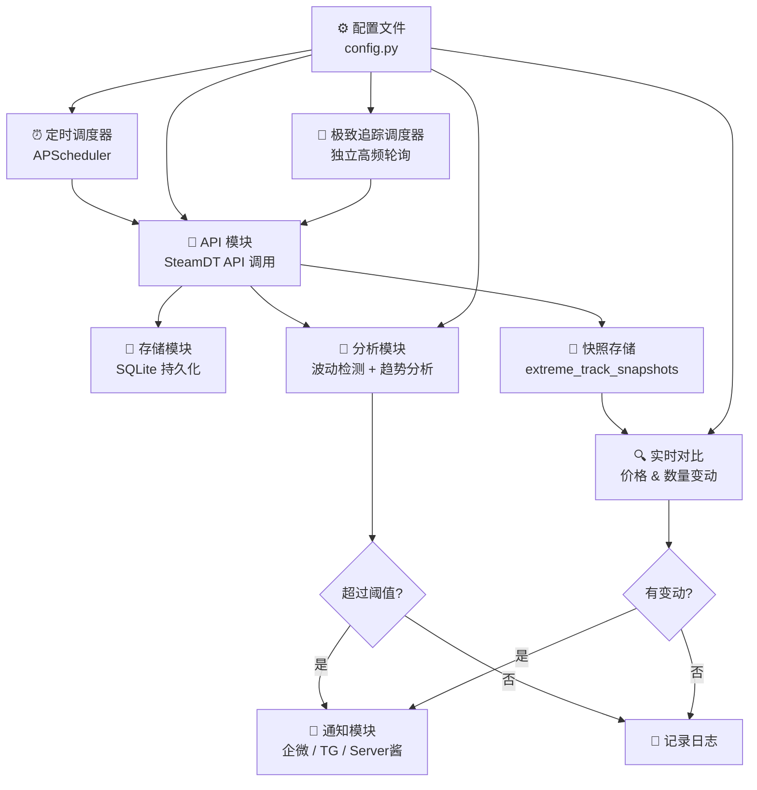

# CS2 饰品价格波动监控系统 — 产品 PRD

<aside>
📌

**文档信息**

- **产品名称**：CS2 饰品价格波动监控通知系统（cs-monitor）
- **版本**：v1.1
- **作者**：树 树
- **创建日期**：2026-04-13
- **开发工具**：Claude Code（CLI）
- **技术栈**：Python 3.12+
</aside>

---

## 1. 产品概述

### 1.1 背景

CS2（Counter-Strike 2）拥有庞大的饰品交易市场，饰品价格受供需、赛事、更新等因素影响频繁波动。玩家和交易者需要一个自动化工具来实时监控关注饰品的价格变化，及时捕捉买入/卖出时机。

### 1.2 产品定位

一个**轻量级、可自托管**的 CS2 饰品价格监控工具，基于 SteamDT 开放平台 API，定时采集价格数据，自动检测异常波动并推送通知。

### 1.3 目标用户

- CS2 饰品收藏玩家
- 饰品交易者（低买高卖）
- 想学习 API 开发的编程新手

---

## 2. 核心功能需求

### 2.1 功能列表

| **功能模块** | **优先级** | **功能描述** | **MVP** |
| --- | --- | --- | --- |
| F1 监控清单管理 | P0 | 用户可添加/移除想要监控的饰品 | ✅ |
| F2 定时价格采集 | P0 | 按设定间隔自动从 SteamDT 拉取各平台价格 | ✅ |
| F3 价格波动检测 | P0 | 对比当前价与基准价，超过阈值触发告警 | ✅ |
| F4 通知推送 | P0 | 通过企微/Telegram/Server酱等渠道推送告警 | ✅ |
| F5 历史价格存储 | P0 | 将每次采集的价格数据持久化到本地数据库 | ✅ |
| F6 7天均价基准 | P1 | 获取近7天均价作为波动判断基准线 | ✅ |
| F7 K线趋势分析 | P2 | 连续N天涨跌趋势检测，辅助决策 |  |
| F8 多平台价差提醒 | P2 | 同一饰品不同平台价差超阈值时提醒套利机会 |  |
| F9 Web 仪表盘 | P3 | 可视化展示价格曲线和监控状态 |  |
| **F10 极致追踪模式** | **P0** | **高频盯死单品，追踪指定平台价格变动和在售数量变化，任何波动立即推送** | **✅** |

---

## 3. 详细功能设计

### 3.1 F1 监控清单管理

**描述**：用户维护一个想要监控的饰品列表

**数据结构**：

```python
# watchlist 条目
{
    "market_hash_name": "AK-47 | Redline (Field-Tested)",
    "display_name": "AK-47 红线 久经沙场",       # 可选中文别名
    "threshold_percent": 5.0,                     # 波动阈值百分比
    "enabled": True,                               # 是否启用监控
    "added_at": "2026-04-13T00:00:00"
}
```

**MVP 实现**：在 `config.py` 中以列表形式配置，后续可迁移到 JSON 文件或数据库。

### 3.2 F2 定时价格采集

**描述**：按照用户设定的时间间隔，批量调用 SteamDT API 获取监控清单中所有饰品的当前价格

**调用接口**：

- `通过 marketHashName 批量查询饰品价格`
- `通过 MarketHashName 查询所有平台近7天均价`

**定时策略**：

- 默认每 **30 分钟** 执行一次（可在 config 中配置）
- 需遵守 SteamDT API 频率限制
- 首次启动时立即执行一次

**容错处理**：

- API 调用失败时重试 3 次，间隔 10 秒
- 连续失败 5 次发送错误通知
- 记录所有 API 调用日志

### 3.3 F3 价格波动检测

**描述**：对比当前价格与基准价格，判断是否触发告警

**波动计算公式**：

```
波动率 = (当前价格 - 基准价格) / 基准价格 × 100%
```

**基准价格来源（优先级）**：

1. **7 天均价**（推荐，通过 API 获取）
2. **上一次采集价格**（兜底方案）

**告警规则**：

| **规则** | **条件** | **通知内容** |
| --- | --- | --- |
| 价格暴涨 | 波动率 ≥ +阈值% | 🔴 [饰品名] 价格暴涨 X%，当前 ¥XX |
| 价格暴跌 | 波动率 ≤ -阈值% | 🟢 [饰品名] 价格暴跌 X%，当前 ¥XX（买入机会？） |
| 防重复通知 | 同一饰品同一方向 4h 内只通知 1 次 | — |

### 3.4 F4 通知推送

**描述**：将告警信息推送到用户选择的通知渠道

**支持渠道**（MVP 至少实现 1 个）：

| **渠道** | **实现方式** | **优先级** |
| --- | --- | --- |
| 企业微信机器人 | Webhook POST JSON | P0（推荐首选） |
| Server 酱 | HTTP GET/POST | P1 |
| Telegram Bot | Bot API sendMessage | P1 |
| 邮件 | Python smtplib | P2 |

**通知消息模板**：

```
⚠️ CS2 饰品价格波动提醒

📦 饰品：AK-47 | Redline (Field-Tested)
💰 当前价格：¥128.50
📊 7天均价：¥120.00
📈 波动幅度：+7.08%
🏪 最低平台：BUFF ¥125.00
🕐 时间：2026-04-13 23:30
```

### 3.5 F5 历史价格存储

**描述**：持久化存储每次采集的价格数据

**技术方案**：SQLite（轻量、无需额外服务）

**数据库表设计**：

```sql
-- 饰品基础信息表
CREATE TABLE items (
    id INTEGER PRIMARY KEY AUTOINCREMENT,
    market_hash_name TEXT UNIQUE NOT NULL,
    display_name TEXT,
    category TEXT,
    created_at TIMESTAMP DEFAULT CURRENT_TIMESTAMP
);

-- 价格记录表
CREATE TABLE price_records (
    id INTEGER PRIMARY KEY AUTOINCREMENT,
    market_hash_name TEXT NOT NULL,
    platform TEXT NOT NULL,          -- buff / igxe / c5 / steam 等
    price REAL NOT NULL,
    recorded_at TIMESTAMP DEFAULT CURRENT_TIMESTAMP,
    FOREIGN KEY (market_hash_name) REFERENCES items(market_hash_name)
);

-- 告警记录表
CREATE TABLE alert_logs (
    id INTEGER PRIMARY KEY AUTOINCREMENT,
    market_hash_name TEXT NOT NULL,
    alert_type TEXT NOT NULL,         -- 'price_surge' / 'price_drop'
    current_price REAL,
    baseline_price REAL,
    change_percent REAL,
    notified_at TIMESTAMP DEFAULT CURRENT_TIMESTAMP
);
```

### 3.6 F10 极致追踪模式 🔥

<aside>
🎯

**核心理念**：盯死一个饰品，盯死一个平台，任何风吹草动立即通知。与 F2/F3 的「批量巡检」不同，极致追踪是**单品高频狙击模式**。

</aside>

#### 3.6.1 功能描述

用户可以针对 **单个饰品 + 单个平台**（如悠悠有品）开启极致追踪，系统以用户自定义的高频间隔持续轮询，追踪两个核心维度：

1. **价格变动**：只要在售价格发生任何变化（或超过设定百分比），立即推送
2. **在售数量变动**：在售数量增加或减少（或变化超过设定百分比），立即推送

#### 3.6.2 追踪配置数据结构

```python
@dataclass
class ExtremeTrackItem:
    # === 基础配置 ===
    market_hash_name: str              # 饰品 marketHashName
    display_name: str = ""             # 中文别名
    platform: str = "youpin"           # 盯死的平台：youpin / buff / igxe / c5 / steam
    enabled: bool = True

    # === 轮询频率 ===
    interval_seconds: int = 60         # 轮询间隔（秒），默认 60 秒
    # 建议值：
    #   - 激进模式：30-60 秒（需确认 API 套餐支持）
    #   - 标准模式：3-5 分钟
    #   - 保守模式：10-30 分钟

    # === 价格追踪 ===
    price_track_enabled: bool = True
    price_change_mode: str = "any"     # "any" = 任何变动都通知 | "percent" = 超过百分比才通知
    price_threshold_percent: float = 0.0  # 当 mode="percent" 时生效，0 表示任何变动

    # === 在售数量追踪 ===
    quantity_track_enabled: bool = True
    quantity_change_mode: str = "any"  # "any" = 任何变动都通知 | "percent" = 超过百分比才通知
    quantity_threshold_percent: float = 0.0  # 当 mode="percent" 时生效

    # === 通知控制 ===
    alert_cooldown_seconds: int = 0    # 通知冷却（秒），0 = 不冷却，每次变动都通知
    quiet_hours_start: str = ""        # 免打扰开始时间 "02:00"，留空不启用
    quiet_hours_end: str = ""          # 免打扰结束时间 "08:00"
```

#### 3.6.3 轮询频率设计

<aside>
⚠️

**频率需根据 SteamDT API 套餐限制设计**，请先查阅 [接口权限列表](https://doc.steamdt.com/6369437m0.md) 确认你的每日/每分钟调用上限。

</aside>

| **模式** | **轮询间隔** | **每小时请求数** | **适用场景** |
| --- | --- | --- | --- |
| 🔴 激进 | 30 秒 | 120 次/h | 重大赛事/更新期间抢先机 |
| 🟡 标准 | 3 分钟 | 20 次/h | 日常重点饰品监控（推荐） |
| 🟢 保守 | 10 分钟 | 6 次/h | 长期持有品关注趋势 |

**自动降频保护**：当检测到 API 返回频率限制错误时，自动将间隔翻倍，恢复后自动回调。

```python
# 自动降频逻辑伪代码
current_interval = config.interval_seconds

if api_response.status == 429:  # Too Many Requests
    current_interval = min(current_interval * 2, 3600)  # 最大不超过 1 小时
    log.warning(f"API 限流，间隔自动调整为 {current_interval}s")
    notify("⚠️ 极致追踪频率已自动降低，API 可能接近限额")
elif consecutive_success >= 10:
    current_interval = max(config.interval_seconds, current_interval // 2)  # 逐步恢复
```

#### 3.6.4 波动检测逻辑

**价格波动**：

```python
def check_price_change(current_price, last_price, config):
    if last_price is None or last_price == 0:
        return None  # 首次采集，不告警

    change = current_price - last_price
    change_percent = (change / last_price) * 100

    if config.price_change_mode == "any" and change != 0:
        return Alert(type="price", change=change, percent=change_percent)
    elif config.price_change_mode == "percent":
        if abs(change_percent) >= config.price_threshold_percent:
            return Alert(type="price", change=change, percent=change_percent)
    return None
```

**在售数量波动**：

```python
def check_quantity_change(current_qty, last_qty, config):
    if last_qty is None:
        return None

    change = current_qty - last_qty
    if last_qty > 0:
        change_percent = (change / last_qty) * 100
    else:
        change_percent = 100.0 if change > 0 else 0

    if config.quantity_change_mode == "any" and change != 0:
        return Alert(type="quantity", change=change, percent=change_percent)
    elif config.quantity_change_mode == "percent":
        if abs(change_percent) >= config.quantity_threshold_percent:
            return Alert(type="quantity", change=change, percent=change_percent)
    return None
```

#### 3.6.5 通知消息模板

**价格变动通知**：

```
🎯 [极致追踪] 价格变动

📦 饰品：AK-47 | Redline (Field-Tested)
🏪 平台：悠悠有品
💰 当前价格：¥128.50
💰 上次价格：¥125.00
📈 变动：+¥3.50（+2.80%）
📊 在售数量：42 件
🕐 时间：2026-04-14 13:30:00
⏱️ 距上次变动：12 分钟
```

**在售数量变动通知**：

```
🎯 [极致追踪] 在售数量变动

📦 饰品：AK-47 | Redline (Field-Tested)
🏪 平台：悠悠有品
📉 当前在售：38 件
📊 上次在售：42 件
🔻 变动：-4 件（-9.52%）
💰 当前价格：¥128.50
🕐 时间：2026-04-14 13:30:00
💡 提示：数量减少可能意味着有人在买入
```

**价格 + 数量同时变动通知**（合并推送）：

```
🎯 [极致追踪] 价格 & 数量同时变动！

📦 饰品：AK-47 | Redline (Field-Tested)
🏪 平台：悠悠有品

💰 价格：¥125.00 → ¥128.50（+2.80%）
📦 数量：42 件 → 38 件（-9.52%）

🕐 时间：2026-04-14 13:30:00
💡 量跌价涨，市场可能在抢货
```

#### 3.6.6 数据库扩展

新增两张表支持极致追踪：

```sql
-- 极致追踪快照表（高频记录，每次轮询都写入）
CREATE TABLE extreme_track_snapshots (
    id INTEGER PRIMARY KEY AUTOINCREMENT,
    market_hash_name TEXT NOT NULL,
    platform TEXT NOT NULL,
    price REAL,
    quantity INTEGER,                -- 在售数量
    recorded_at TIMESTAMP DEFAULT CURRENT_TIMESTAMP
);

-- 为查询性能添加索引
CREATE INDEX idx_snapshot_item_time
    ON extreme_track_snapshots(market_hash_name, platform, recorded_at DESC);

-- 极致追踪告警记录表
CREATE TABLE extreme_track_alerts (
    id INTEGER PRIMARY KEY AUTOINCREMENT,
    market_hash_name TEXT NOT NULL,
    platform TEXT NOT NULL,
    alert_type TEXT NOT NULL,         -- 'price_change' / 'quantity_change' / 'both'
    prev_price REAL,
    curr_price REAL,
    price_change_percent REAL,
    prev_quantity INTEGER,
    curr_quantity INTEGER,
    quantity_change_percent REAL,
    notified_at TIMESTAMP DEFAULT CURRENT_TIMESTAMP
);
```

#### 3.6.7 与普通监控的关系

| **对比项** | **普通监控（F2/F3）** | **极致追踪（F10）** |
| --- | --- | --- |
| 监控目标 | 多个饰品批量巡检 | 单品高频狙击 |
| 轮询频率 | 30 分钟 | 30 秒 ~ 30 分钟（可自定义） |
| 触发条件 | 偏离 7 天均价超阈值 | 任何价格/数量变动或超设定百分比 |
| 追踪维度 | 仅价格 | 价格 + 在售数量 |
| 平台选择 | 所有平台 | 指定单个平台 |
| 通知冷却 | 4 小时 | 可设为 0（不冷却） |
| API 消耗 | 低 | 高（需注意套餐限制） |

两个模式**独立运行、互不影响**，同一饰品可以同时在普通监控清单中（看大盘）和极致追踪中（盯单品）。

---

## 3.7 业务流程图

### 全局流程：系统启动 → 双模式并行运行



### 流程 A：普通监控模式（批量巡检）



### 流程 B：极致追踪模式（单品狙击）



### 流程 C：通知推送流程



---

## 4. 技术架构

### 4.1 架构图



### 4.2 技术选型

| **组件** | **技术选型** | **选型理由** |
| --- | --- | --- |
| 编程语言 | Python 3.12+ | 生态丰富，新手友好，API 调用方便 |
| HTTP 客户端 | httpx（推荐）或 requests | 支持异步，性能好；requests 更简单 |
| 定时调度 | APScheduler | 功能完善，支持 cron/interval 多种模式 |
| 数据存储 | SQLite | 零配置，文件级数据库，适合单机部署 |
| 日志 | loguru | 开箱即用，比标准 logging 更易用 |
| 配置管理 | python-dotenv + dataclass | 环境变量管理敏感信息，dataclass 做类型校验 |

### 4.3 项目目录结构

```jsx
cs-monitor/
├── .env                    # 环境变量（API Key、Webhook URL 等敏感信息）
├── .env.example            # 环境变量模板
├── config.py               # 配置类（阈值、间隔、监控清单）
├── main.py                 # 入口：初始化 + 启动调度器
├── api/
│   ├── __init__.py
│   └── steamdt.py          # SteamDT API 封装
├── core/
│   ├── __init__.py
│   ├── monitor.py          # 价格采集调度逻辑（普通模式）
│   ├── extreme_tracker.py  # 🆕 极致追踪模块（高频单品追踪）
│   ├── analyzer.py         # 波动检测 + 趋势分析
│   └── scheduler.py        # 定时任务管理
├── notify/
│   ├── __init__.py
│   ├── base.py             # 通知基类（接口抽象）
│   ├── wecom.py            # 企业微信机器人
│   ├── telegram.py         # Telegram Bot
│   └── serverchan.py       # Server 酱
├── storage/
│   ├── __init__.py
│   ├── database.py         # SQLite 连接与操作
│   └── models.py           # 数据模型定义
├── utils/
│   ├── __init__.py
│   └── logger.py           # 日志配置
├── data/
│   └── prices.db           # SQLite 数据库文件（自动生成）
├── tests/
│   ├── test_api.py
│   ├── test_analyzer.py
│   └── test_notify.py
├── requirements.txt        # 依赖清单
└── README.md               # 项目说明
```

---

## 5. API 接口使用规范

<aside>
⚠️

**重要限制**：

- 「获取 Steam 饰品基础信息」接口**每天只能调用 1 次**，必须本地缓存返回数据
- 所有接口调用需携带 API Key，注意保密（使用 `.env` 管理）
- 严格遵守套餐的频率限制，超频可能被封禁
- 建议在请求间加入随机延迟（1-3 秒），避免触发风控
</aside>

**需要用到的接口**：

1. **获取 Steam 饰品基础信息** — 初始化调用，建立本地饰品数据库
2. **通过 marketHashName 批量查询饰品价格** — 核心接口，定时批量查价
3. **通过 MarketHashName 查询所有平台近 7 天均价** — 获取基准价格
4. **查询 Steam 饰品 K 线数据** — 进阶功能，趋势分析用

---

## 6. 配置项设计

```python
# config.py 示例
from dataclasses import dataclass, field

@dataclass
class MonitorConfig:
    # === API 配置 ===
    api_key: str = ""                          # 从 .env 读取
    api_base_url: str = "https://api.steamdt.com"
    request_timeout: int = 30                   # 请求超时（秒）
    request_retry: int = 3                      # 失败重试次数

    # === 监控配置 ===
    check_interval_minutes: int = 30            # 价格检查间隔（分钟）
    default_threshold_percent: float = 5.0      # 默认波动阈值（%）
    alert_cooldown_hours: int = 4               # 同一饰品告警冷却时间（小时）

    # === 通知配置 ===
    notify_channel: str = "wecom"               # wecom / telegram / serverchan / email
    wecom_webhook_url: str = ""                 # 企微机器人 Webhook
    telegram_bot_token: str = ""                # TG Bot Token
    telegram_chat_id: str = ""                  # TG Chat ID

    # === 监控清单 ===
    watchlist: list = field(default_factory=lambda: [
        {"name": "AK-47 | Redline (Field-Tested)", "threshold": 5.0},
        {"name": "AWP | Asiimov (Field-Tested)", "threshold": 5.0},
        {"name": "M4A4 | Howl (Factory New)", "threshold": 3.0},
    ])

    # === 🆕 极致追踪配置 ===
    extreme_track_list: list = field(default_factory=lambda: [
        {
            "name": "AK-47 | Redline (Field-Tested)",
            "display_name": "AK-47 红线",
            "platform": "youpin",            # 盯死悠悠有品
            "interval_seconds": 60,           # 每 60 秒查一次
            "price_change_mode": "any",       # 任何价格变动都通知
            "quantity_track_enabled": True,    # 追踪在售数量
            "quantity_change_mode": "any",    # 任何数量变动都通知
            "alert_cooldown_seconds": 0,       # 不冷却
        },
    ])
```

---

## 7. Claude Code 开发指南

<aside>
🤖

以下是使用 **Claude Code** 开发此项目的推荐步骤和提示词模板，帮助你高效完成开发。

</aside>

### 7.1 开发流程

1. **初始化项目**

```bash
mkdir cs-monitor && cd cs-monitor
claude
```

1. **分模块逐步开发**（每次让 Claude Code 完成一个模块）

### 7.2 推荐 Prompt 顺序

**Step 1 — 项目脚手架**

```
帮我初始化一个 Python 项目 cs-monitor：
- 创建上面 PRD 中的目录结构
- 生成 requirements.txt（httpx, apscheduler, loguru, python-dotenv）
- 创建 .env.example 模板
- 创建 config.py 配置类
- 创建 README.md
```

**Step 2 — API 封装**

```
基于 SteamDT 开放平台文档，帮我封装 api/steamdt.py：
- 实现 SteamDTClient 类
- 支持以下接口：批量查询饰品价格、查询7天均价、查询K线数据、获取饰品基础信息
- 统一错误处理和重试逻辑
- 从 .env 读取 API Key
```

**Step 3 — 数据存储**

```
帮我实现 storage/ 模块：
- 使用 SQLite 作为存储
- 按照 PRD 中的表结构创建 items、price_records、alert_logs 三张表
- 封装 CRUD 操作
- 首次运行时自动建表
```

**Step 4 — 核心监控逻辑**

```
帮我实现 core/ 模块：
- monitor.py：定时调用 API 批量查价，结果存入数据库
- analyzer.py：对比当前价和7天均价，超过阈值返回告警列表
- 支持告警冷却（同一饰品同一方向4小时内只告警1次）
```

**Step 4.5 — 极致追踪模块** 🆕

```jsx
帮我实现 core/extreme_tracker.py 极致追踪模块：
- 按照 PRD 中 F10 的设计，实现单品高频追踪
- 支持自定义轮询间隔（秒级）
- 每次轮询写入 extreme_track_snapshots 表
- 对比上一次快照，检测价格和在售数量变动
- 支持两种模式：any（任何变动通知）和 percent（超百分比通知）
- 实现自动降频保护：API 返回 429 时自动翻倍间隔，恢复后逐步回调
- 价格和数量同时变动时合并为一条通知
- 在 scheduler.py 中为极致追踪注册独立的定时任务
```

**Step 5 — 通知模块**

```
帮我实现 notify/ 模块：
- 定义通知基类 base.py（send 方法）
- 实现企业微信机器人推送 wecom.py
- 按照 PRD 中的消息模板格式化通知内容
- 支持通过 config 切换通知渠道
```

**Step 6 — 主程序串联**

```
帮我实现 main.py 入口：
- 加载配置
- 初始化数据库
- 启动 APScheduler 定时任务
- 首次启动立即执行一次
- 优雅退出处理（Ctrl+C）
```

**Step 7 — 测试**

```
帮我写 tests/ 下的单元测试：
- test_api.py：mock API 响应，测试解析逻辑
- test_analyzer.py：测试波动检测阈值判断
- test_notify.py：测试消息格式化
```

---

## 8. 验收标准

### MVP 验收（v1.0）

- [ ]  能通过配置文件设定监控饰品列表
- [ ]  每 30 分钟自动获取一次价格数据
- [ ]  价格数据持久化存储到 SQLite
- [ ]  价格波动超过阈值时推送通知（至少支持 1 个渠道）
- [ ]  同一饰品同方向告警有冷却期，不重复轰炸
- [ ]  **极致追踪：能盯死单品+单平台，自定义轮询间隔**
- [ ]  **极致追踪：价格变动实时推送通知**
- [ ]  **极致追踪：在售数量变动实时推送通知**
- [ ]  **极致追踪：API 限流自动降频保护**
- [ ]  程序可稳定后台运行，异常自动恢复
- [ ]  有基本的日志输出

### 进阶验收（v2.0）

- [ ]  K 线趋势分析，连续涨跌提醒
- [ ]  多平台价差套利提醒
- [ ]  Web 仪表盘查看价格曲线
- [ ]  支持通过 Notion 数据库动态管理监控清单

---

## 9. 风险与注意事项

| **风险** | **影响** | **应对措施** |
| --- | --- | --- |
| API 频率限制 | 请求被拒绝，无法获取数据 | 严格控制调用频率 + 本地缓存 + 请求间随机延迟 |
| API Key 泄露 | 账号安全风险 | 使用 .env 管理，.gitignore 排除 |
| SteamDT 服务不可用 | 数据断流 | 重试机制 + 错误通知 + 本地缓存兜底 |
| 价格数据异常 | 误触发告警 | 加入合理性校验（价格 > 0、波动 < 50% 等） |
| 长期运行稳定性 | 进程崩溃、内存泄漏 | 异常捕获 + 日志 + 可选 systemd/pm2 守护 |