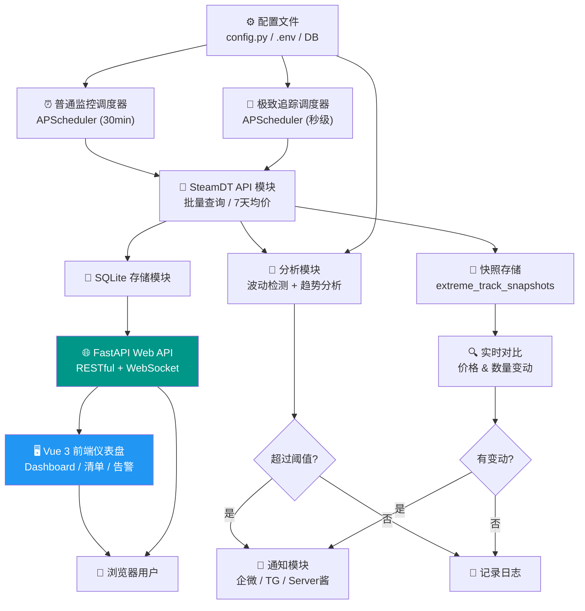
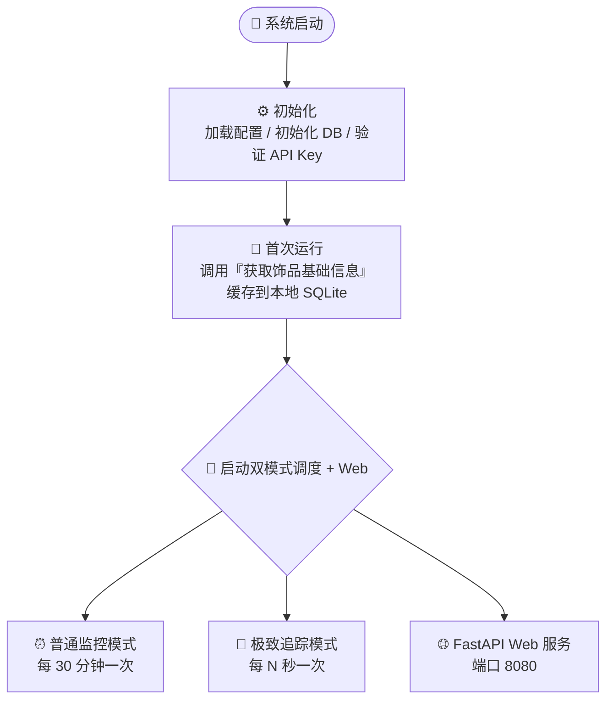
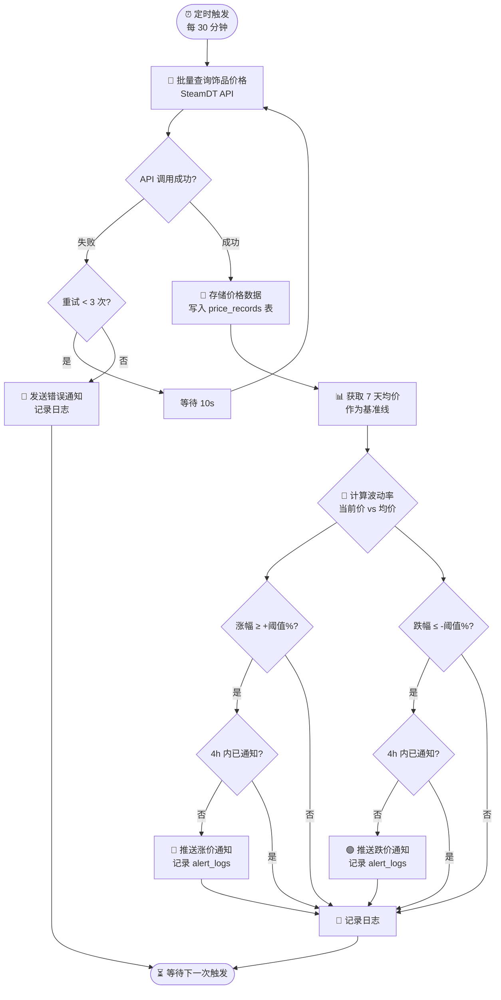
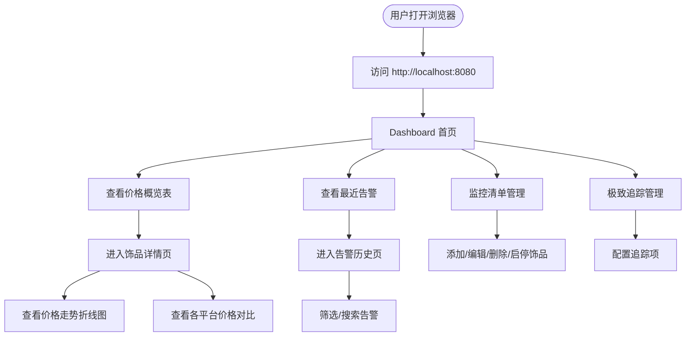
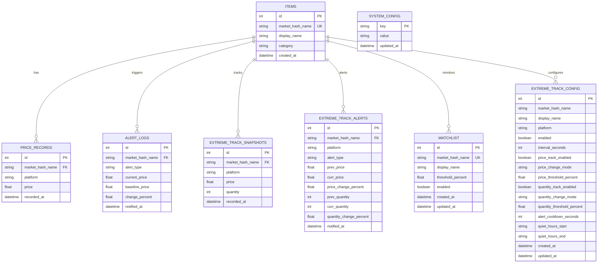

# CS2 饰品价格波动监控系统 — 架构设计文档

## 项目概述

一个**轻量级、可自托管**的 CS2 饰品价格监控平台，基于 SteamDT 开放平台 API，支持 CLI 监控 + Web 仪表盘双模式。用户可通过浏览器完成所有监控操作：查看价格、管理清单、分析趋势、接收告警，**无需修改任何配置文件**。

核心特色是**双模式并行运行**：
- **普通监控模式**：批量巡检多个饰品，每 30 分钟一次，对比 7 天均价判断波动
- **极致追踪模式**：单品高频狙击，自定义秒级轮询，追踪指定平台的价格和在售数量变动
- **Web 仪表盘**：FastAPI + Vue 3 前后端分离，可视化所有监控数据

---

## 技术栈

| 层级 | 技术选型 | 说明 |
|-----|---------|------|
| 编程语言 | Python 3.12+ | 生态丰富，API 调用方便 |
| Web 框架 | FastAPI | 异步高性能、自带 OpenAPI 文档、Pydantic v2 类型校验 |
| HTTP 客户端 | httpx | 支持异步，性能好 |
| 定时调度 | APScheduler | 支持 cron/interval 多种模式 |
| 数据存储 | SQLite (WAL 模式) | 零配置，文件级数据库，支持并发写入 |
| 前端框架 | Vue 3 + Vite + TypeScript | 轻量、组件化、响应式 |
| UI 组件库 | Naive UI | 中文文档完善，组件丰富 |
| 图表库 | ECharts 5 | K线/折线/柱状图全覆盖 |
| 状态管理 | Pinia | 轻量替代 Vuex |
| 路由 | Vue Router 4 | 官方路由方案 |
| CSS | UnoCSS | 原子化 CSS，快速开发 |
| HTTP 客户端 | axios | 拦截器、请求取消 |
| 日志 | loguru | 开箱即用 |
| 配置管理 | python-dotenv + dataclass | 环境变量管理敏感信息 |

---

## 1. 系统架构图



---

## 2. 核心业务流程图

### 全局流程：系统启动 → 双模式并行 + Web 服务



### 流程 A：普通监控模式（批量巡检）



### 流程 B：极致追踪模式（单品狙击）


### Web 仪表盘用户旅程



---

## 3. 数据模型

### 3.1 数据库表结构

```sql
-- 饰品基础信息表
CREATE TABLE items (
    id INTEGER PRIMARY KEY AUTOINCREMENT,
    market_hash_name TEXT UNIQUE NOT NULL,
    display_name TEXT,
    category TEXT,
    created_at TIMESTAMP DEFAULT CURRENT_TIMESTAMP
);

-- 价格记录表（普通监控）
CREATE TABLE price_records (
    id INTEGER PRIMARY KEY AUTOINCREMENT,
    market_hash_name TEXT NOT NULL,
    platform TEXT NOT NULL,
    price REAL NOT NULL,
    recorded_at TIMESTAMP DEFAULT CURRENT_TIMESTAMP,
    FOREIGN KEY (market_hash_name) REFERENCES items(market_hash_name)
);

-- 告警记录表（普通监控）
CREATE TABLE alert_logs (
    id INTEGER PRIMARY KEY AUTOINCREMENT,
    market_hash_name TEXT NOT NULL,
    alert_type TEXT NOT NULL,
    current_price REAL,
    baseline_price REAL,
    change_percent REAL,
    notified_at TIMESTAMP DEFAULT CURRENT_TIMESTAMP
);

-- 极致追踪快照表
CREATE TABLE extreme_track_snapshots (
    id INTEGER PRIMARY KEY AUTOINCREMENT,
    market_hash_name TEXT NOT NULL,
    platform TEXT NOT NULL,
    price REAL,
    quantity INTEGER,
    recorded_at TIMESTAMP DEFAULT CURRENT_TIMESTAMP
);

CREATE INDEX idx_snapshot_item_time
    ON extreme_track_snapshots(market_hash_name, platform, recorded_at DESC);

-- 极致追踪告警记录表
CREATE TABLE extreme_track_alerts (
    id INTEGER PRIMARY KEY AUTOINCREMENT,
    market_hash_name TEXT NOT NULL,
    platform TEXT NOT NULL,
    alert_type TEXT NOT NULL,
    prev_price REAL,
    curr_price REAL,
    price_change_percent REAL,
    prev_quantity INTEGER,
    curr_quantity INTEGER,
    quantity_change_percent REAL,
    notified_at TIMESTAMP DEFAULT CURRENT_TIMESTAMP
);

-- 监控清单表（v2.0 新增，从 config.py 迁移）
CREATE TABLE watchlist (
    id INTEGER PRIMARY KEY AUTOINCREMENT,
    market_hash_name TEXT UNIQUE NOT NULL,
    display_name TEXT DEFAULT '',
    threshold_percent REAL DEFAULT 5.0,
    enabled INTEGER DEFAULT 1,
    created_at TIMESTAMP DEFAULT CURRENT_TIMESTAMP,
    updated_at TIMESTAMP DEFAULT CURRENT_TIMESTAMP
);

-- 极致追踪配置表（v2.0 新增，从 config.py 迁移）
CREATE TABLE extreme_track_config (
    id INTEGER PRIMARY KEY AUTOINCREMENT,
    market_hash_name TEXT NOT NULL,
    display_name TEXT DEFAULT '',
    platform TEXT NOT NULL DEFAULT 'youpin',
    enabled INTEGER DEFAULT 1,
    interval_seconds INTEGER DEFAULT 60,
    price_track_enabled INTEGER DEFAULT 1,
    price_change_mode TEXT DEFAULT 'any',
    price_threshold_percent REAL DEFAULT 0.0,
    quantity_track_enabled INTEGER DEFAULT 1,
    quantity_change_mode TEXT DEFAULT 'any',
    quantity_threshold_percent REAL DEFAULT 0.0,
    alert_cooldown_seconds INTEGER DEFAULT 0,
    quiet_hours_start TEXT DEFAULT '',
    quiet_hours_end TEXT DEFAULT '',
    created_at TIMESTAMP DEFAULT CURRENT_TIMESTAMP,
    updated_at TIMESTAMP DEFAULT CURRENT_TIMESTAMP,
    UNIQUE(market_hash_name, platform)
);

-- 系统配置表（v2.0 新增，通知渠道等配置）
CREATE TABLE system_config (
    key TEXT PRIMARY KEY,
    value TEXT NOT NULL,
    updated_at TIMESTAMP DEFAULT CURRENT_TIMESTAMP
);
```

### 3.2 实体关系图



---

## 4. 项目目录结构

```
cs-monitor/
├── .env                         # 环境变量（API Key、Webhook URL 等敏感信息）
├── .env.example                 # 环境变量模板
├── config.py                    # 配置类（阈值、间隔、监控清单默认值）
├── main.py                      # 入口：初始化 + 启动调度器 + FastAPI Web 服务
├── requirements.txt             # Python 依赖
├── README.md                    # 项目说明
├── CLAUDE.md                    # AI Agent 工作流规范
├── architecture.md              # 本文档
├── task.json                    # 开发任务清单
├── progress.txt                 # 开发进度日志
├── init.sh                      # 环境初始化脚本
├── run-automation.sh            # 全自动循环脚本（Linux/macOS/Git Bash）
├── run-automation.ps1           # 全自动循环脚本（Windows PowerShell）
├── api/
│   ├── __init__.py
│   └── steamdt.py               # SteamDT API 封装
├── core/
│   ├── __init__.py
│   ├── monitor.py               # 普通监控：价格采集调度
│   ├── extreme_tracker.py       # 极致追踪：高频单品追踪
│   ├── analyzer.py              # 波动检测 + 趋势分析
│   └── scheduler.py             # APScheduler 定时任务管理
├── notify/
│   ├── __init__.py
│   ├── base.py                  # 通知基类
│   ├── manager.py               # 通知管理器
│   ├── wecom.py                 # 企业微信机器人
│   ├── telegram.py              # Telegram Bot
│   └── serverchan.py            # Server 酱
├── storage/
│   ├── __init__.py
│   ├── database.py              # SQLite 连接与操作
│   └── models.py                # 数据模型/表定义
├── web/                         # 🆕 FastAPI Web 层（v2.0）
│   ├── __init__.py
│   ├── app.py                   # FastAPI 应用入口
│   ├── deps.py                  # 依赖注入（db session 等）
│   ├── schemas.py               # Pydantic 模型
│   ├── ws_manager.py            # WebSocket 连接管理
│   └── routers/
│       ├── __init__.py
│       ├── dashboard.py         # /api/dashboard/*
│       ├── watchlist.py         # /api/watchlist/*
│       ├── extreme_track.py     # /api/extreme-track/*
│       ├── prices.py            # /api/prices/*
│       ├── alerts.py            # /api/alerts/*
│       ├── settings.py          # /api/settings/*
│       └── kline.py             # /api/kline/*、/api/arbitrage/*、/api/trends/*
├── frontend/                    # 🆕 Vue 3 前端（v2.0）
│   ├── package.json
│   ├── vite.config.ts
│   ├── index.html
│   ├── src/
│   │   ├── main.ts
│   │   ├── App.vue
│   │   ├── router/
│   │   │   └── index.ts
│   │   ├── stores/              # Pinia 状态管理
│   │   │   ├── dashboard.ts
│   │   │   ├── watchlist.ts
│   │   │   ├── alerts.ts
│   │   │   └── extremeTrack.ts
│   │   ├── api/                 # axios 封装
│   │   │   └── index.ts
│   │   ├── views/
│   │   │   ├── Dashboard.vue
│   │   │   ├── Watchlist.vue
│   │   │   ├── ItemDetail.vue
│   │   │   ├── ExtremeTrack.vue
│   │   │   ├── Alerts.vue
│   │   │   └── Settings.vue
│   │   └── components/
│   │       ├── StatCard.vue
│   │       ├── PriceTable.vue
│   │       ├── AlertList.vue
│   │       ├── PriceChart.vue
│   │       ├── KlineChart.vue
│   │       ├── PlatformCompare.vue
│   │       └── ArbitrageTable.vue
│   └── public/
├── utils/
│   ├── __init__.py
│   └── logger.py                # loguru 日志配置
├── data/
│   └── prices.db                # SQLite 数据库文件（自动生成）
└── tests/
    ├── __init__.py
    ├── test_api.py
    ├── test_analyzer.py
    ├── test_notify.py
    ├── test_monitor.py
    ├── test_extreme_tracker.py
    ├── test_storage.py
    └── test_web_api.py          # 🆕 Web API 测试
```

---

## 5. API 设计

### 5.1 RESTful API 端点

| Method | Path | Description | Auth |
|--------|------|-------------|------|
| GET | /api/health | 健康检查 | 公开 |
| GET | /api/dashboard/summary | Dashboard 概览数据 | 公开 (Phase 3 需认证) |
| GET | /api/system/status | 系统运行状态 | 公开 (Phase 3 需认证) |
| GET | /api/watchlist | 获取所有监控项 | 公开 (Phase 3 需认证) |
| POST | /api/watchlist | 添加监控项 | 公开 (Phase 3 需认证) |
| PUT | /api/watchlist/{id} | 编辑监控项 | 公开 (Phase 3 需认证) |
| DELETE | /api/watchlist/{id} | 删除监控项 | 公开 (Phase 3 需认证) |
| GET | /api/extreme-track | 获取所有追踪项 | 公开 (Phase 3 需认证) |
| POST | /api/extreme-track | 添加追踪项 | 公开 (Phase 3 需认证) |
| PUT | /api/extreme-track/{id} | 编辑追踪项 | 公开 (Phase 3 需认证) |
| DELETE | /api/extreme-track/{id} | 删除追踪项 | 公开 (Phase 3 需认证) |
| POST | /api/extreme-track/{id}/toggle | 启停追踪 | 公开 (Phase 3 需认证) |
| GET | /api/prices/latest | 所有监控品最新价 | 公开 (Phase 3 需认证) |
| GET | /api/prices/{name}/history | 单品历史价格 | 公开 (Phase 3 需认证) |
| GET | /api/prices/{name}/platforms | 单品各平台当前价 | 公开 (Phase 3 需认证) |
| GET | /api/alerts | 告警列表（分页+过滤） | 公开 (Phase 3 需认证) |
| GET | /api/alerts/stats | 告警统计 | 公开 (Phase 3 需认证) |
| GET | /api/settings/notify | 获取通知配置（脱敏） | 公开 (Phase 3 需认证) |
| PUT | /api/settings/notify | 更新通知配置 | 公开 (Phase 3 需认证) |
| POST | /api/settings/notify/test | 测试通知发送 | 公开 (Phase 3 需认证) |
| GET | /api/kline/{name} | K线数据 | 公开 (Phase 3 需认证) |
| GET | /api/arbitrage | 所有监控品跨平台价差 | 公开 (Phase 3 需认证) |
| GET | /api/arbitrage/{name} | 单品各平台价差明细 | 公开 (Phase 3 需认证) |
| GET | /api/trends/{name} | 趋势标签 | 公开 (Phase 3 需认证) |
| WS | /ws/alerts | 实时告警推送 | 公开 (Phase 3 需认证) |
| WS | /ws/extreme-track/{id} | 单品追踪实时数据流 | 公开 (Phase 3 需认证) |

### 5.2 关键 Pydantic 模型

```python
from pydantic import BaseModel, Field
from datetime import datetime

# --- Dashboard ---
class DashboardSummary(BaseModel):
    total_watchlist: int
    active_watchlist: int
    extreme_track_count: int
    total_alerts_today: int
    total_alerts_7d: int
    last_collect_time: datetime | None
    system_uptime_seconds: int
    scheduler_running: bool

# --- Watchlist ---
class WatchlistItem(BaseModel):
    id: int | None = None
    market_hash_name: str
    display_name: str = ""
    threshold_percent: float = 5.0
    enabled: bool = True

class WatchlistItemWithPrice(WatchlistItem):
    current_price: float | None = None
    avg_price_7d: float | None = None
    change_percent: float | None = None
    lowest_platform: str | None = None
    lowest_price: float | None = None
    last_updated: datetime | None = None

# --- Price History ---
class PricePoint(BaseModel):
    price: float
    platform: str
    recorded_at: datetime

class PriceHistoryResponse(BaseModel):
    market_hash_name: str
    display_name: str
    data: list[PricePoint]
    avg_7d: float | None = None

# --- Alerts ---
class AlertRecord(BaseModel):
    id: int
    market_hash_name: str
    display_name: str
    alert_type: str
    current_price: float | None
    baseline_price: float | None
    change_percent: float | None
    notified_at: datetime
    source: str = "normal"
```

---

## 6. 外部服务集成

### SteamDT 开放平台

**官方文档**：
- **LLMs 优化文档（推荐）**: https://doc.steamdt.com/llms.txt
- **完整 API 文档**: https://doc.steamdt.com/

> **开发提示**：如果在实现 API 封装时遇到接口定义不清、参数不确定、响应格式不明等问题，**优先查阅 https://doc.steamdt.com/llms.txt**，该文档专为 AI 阅读优化。

**重要限制**：
- 「获取 Steam 饰品基础信息」接口**每天只能调用 1 次**，必须本地缓存
- 所有接口调用需携带 API Key（使用 `.env` 管理）
- 严格遵守套餐频率限制
- 请求间加入随机延迟（1-3 秒），避免触发风控

**需要用到的接口**：

1. **获取 Steam 饰品基础信息** — 初始化调用，建立本地饰品数据库
2. **通过 marketHashName 批量查询饰品价格** — 核心接口，定时批量查价
3. **通过 MarketHashName 查询所有平台近 7 天均价** — 获取基准价格
4. **查询 Steam 饰品 K 线数据** — Phase 2，趋势分析用

**认证方式**：
```
Authorization: Bearer {STEAMDT_API_KEY}
```

**批量查询饰品价格示例**：
```python
# Request
POST https://open.steamdt.com/v1/prices/batch
Headers: Authorization: Bearer your_api_key_here
Body: {"items": ["AK-47 | Redline (Field-Tested)"]}

# Response
{
    "success": true,
    "data": [
        {
            "marketHashName": "AK-47 | Redline (Field-Tested)",
            "prices": [
                {"platform": "buff", "price": 125.00, "currency": "CNY"},
                {"platform": "youpin", "price": 128.00, "currency": "CNY"}
            ]
        }
    ]
}
```

**查询 7 天均价示例**：
```python
# Request
GET https://open.steamdt.com/v1/prices/average?marketHashName=AK-47%20|%20Redline%20(Field-Tested)&days=7
Headers: Authorization: Bearer your_api_key_here

# Response
{
    "success": true,
    "data": {
        "marketHashName": "AK-47 | Redline (Field-Tested)",
        "averagePrice": 120.00,
        "platform": "all"
    }
}
```

---

## 7. 配置项设计

```python
@dataclass
class MonitorConfig:
    # === API 配置 ===
    api_key: str = ""                          # 从 .env 读取
    api_base_url: str = "https://api.steamdt.com"
    request_timeout: int = 30                   # 请求超时（秒）
    request_retry: int = 3                      # 失败重试次数

    # === 监控配置 ===
    check_interval_minutes: int = 30            # 价格检查间隔（分钟）
    default_threshold_percent: float = 5.0      # 默认波动阈值（%）
    alert_cooldown_hours: int = 4               # 同一饰品告警冷却时间（小时）

    # === Web 服务配置 ===
    web_host: str = "0.0.0.0"                   # Web 服务监听地址
    web_port: int = 8080                        # Web 服务端口

    # === 通知配置 ===
    notify_channel: str = "wecom"               # wecom / telegram / serverchan
    wecom_webhook_url: str = ""                 # 企微机器人 Webhook
    telegram_bot_token: str = ""                # TG Bot Token
    telegram_chat_id: str = ""                  # TG Chat ID
    serverchan_sendkey: str = ""                # Server 酱 SendKey

    # === 前端开发配置 ===
    frontend_dev_port: int = 5173               # Vite 开发服务器端口
    enable_cors: bool = True                    # 是否启用 CORS（开发模式）
```

---

## 8. 通知消息模板

### 普通监控 — 价格暴涨

```
⚠️ CS2 饰品价格波动提醒

📦 饰品：AK-47 | Redline (Field-Tested)
💰 当前价格：¥128.50
📊 7天均价：¥120.00
📈 波动幅度：+7.08%
🏪 最低平台：BUFF ¥125.00
🕐 时间：2026-04-13 23:30
```

### 极致追踪 — 价格变动

```
🎯 [极致追踪] 价格变动

📦 饰品：AK-47 | Redline (Field-Tested)
🏪 平台：悠悠有品
💰 当前价格：¥128.50
💰 上次价格：¥125.00
📈 变动：+¥3.50（+2.80%）
📊 在售数量：42 件
🕐 时间：2026-04-14 13:30:00
⏱️ 距上次变动：12 分钟
```

### 极致追踪 — 在售数量变动

```
🎯 [极致追踪] 在售数量变动

📦 饰品：AK-47 | Redline (Field-Tested)
🏪 平台：悠悠有品
📉 当前在售：38 件
📊 上次在售：42 件
🔻 变动：-4 件（-9.52%）
💰 当前价格：¥128.50
🕐 时间：2026-04-14 13:30:00
💡 提示：数量减少可能意味着有人在买入
```

### 极致追踪 — 价格 & 数量同时变动

```
🎯 [极致追踪] 价格 & 数量同时变动！

📦 饰品：AK-47 | Redline (Field-Tested)
🏪 平台：悠悠有品

💰 价格：¥125.00 → ¥128.50（+2.80%）
📦 数量：42 件 → 38 件（-9.52%）

🕐 时间：2026-04-14 13:30:00
💡 量跌价涨，市场可能在抢货
```

---

## 9. WebSocket 推送消息格式

```json
{
    "type": "alert",
    "data": {
        "market_hash_name": "AK-47 | Redline (FT)",
        "alert_type": "price_change",
        "prev_price": 125.00,
        "curr_price": 128.50,
        "change_percent": 2.80,
        "platform": "youpin",
        "timestamp": "2026-04-16T15:30:00"
    }
}
```

---

## 10. Docker 部署方案

```yaml
# docker-compose.yml
version: '3.8'
services:
  cs-monitor:
    build: .
    ports:
      - "8080:8080"
    volumes:
      - ./data:/app/data
      - ./.env:/app/.env
    environment:
      - TZ=Asia/Shanghai
    restart: unless-stopped
    healthcheck:
      test: ["CMD", "curl", "-f", "http://localhost:8080/api/health"]
      interval: 30s
      timeout: 10s
      retries: 3
```

```dockerfile
# Dockerfile
FROM node:20-slim AS frontend-builder
WORKDIR /app/frontend
COPY frontend/ .
RUN npm ci && npm run build

FROM python:3.12-slim
WORKDIR /app
COPY requirements.txt .
RUN pip install --no-cache-dir -r requirements.txt
COPY . .
COPY --from=frontend-builder /app/frontend/dist /app/static
CMD ["python", "main.py"]
```
