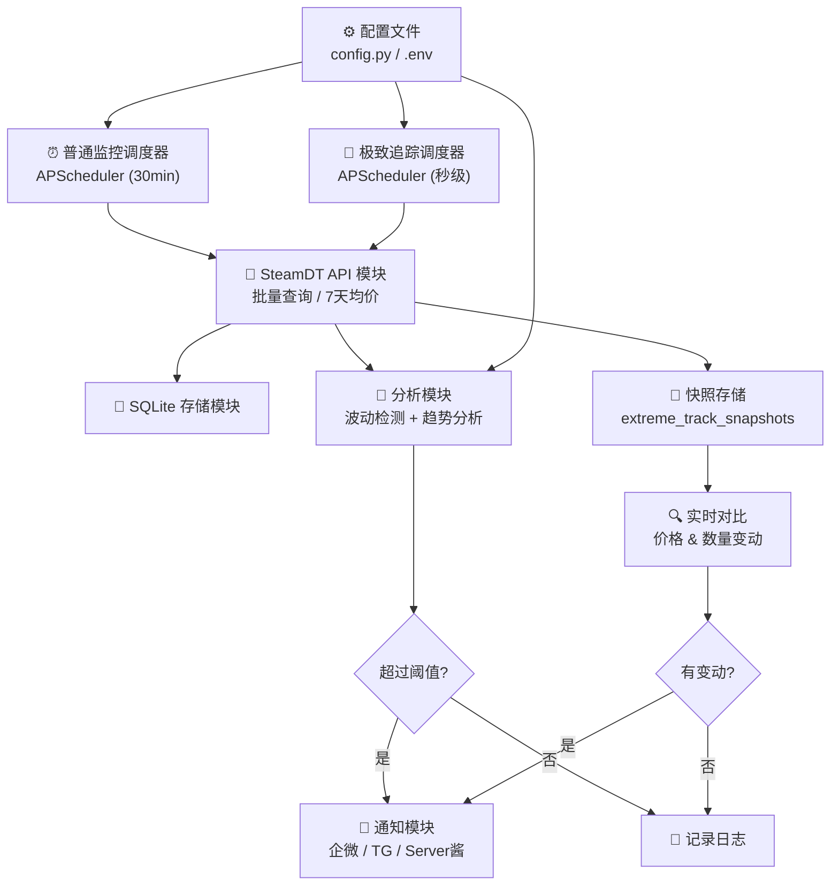
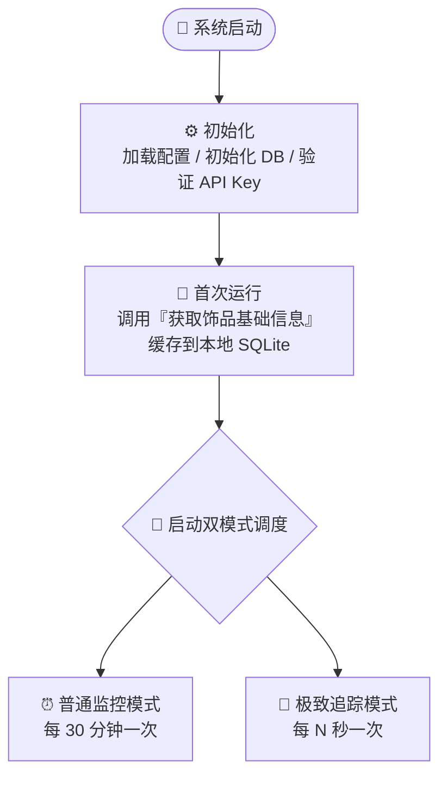
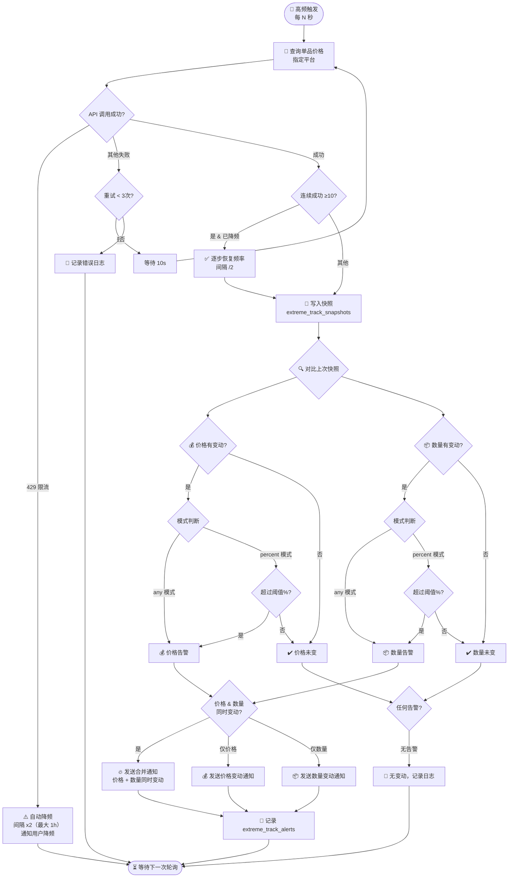

# CS2 饰品价格波动监控系统 — 架构设计文档

## 项目概述

一个**轻量级、可自托管**的 CS2 饰品价格监控工具，基于 SteamDT 开放平台 API，定时采集价格数据，自动检测异常波动并推送通知。

核心特色是**双模式并行运行**：
- **普通监控模式**：批量巡检多个饰品，每 30 分钟一次，对比 7 天均价判断波动
- **极致追踪模式**：单品高频狙击，自定义秒级轮询，追踪指定平台的价格和在售数量变动

---

## 技术栈

| 层级 | 技术选型 | 说明 |
|-----|---------|------|
| 编程语言 | Python 3.12+ | 生态丰富，API 调用方便 |
| HTTP 客户端 | httpx | 支持异步，性能好 |
| 定时调度 | APScheduler | 支持 cron/interval 多种模式 |
| 数据存储 | SQLite | 零配置，文件级数据库 |
| 日志 | loguru | 开箱即用 |
| 配置管理 | python-dotenv + dataclass | 环境变量管理敏感信息 |

---

## 1. 系统架构图



---

## 2. 核心业务流程图

### 全局流程：系统启动 → 双模式并行运行



### 流程 A：普通监控模式（批量巡检）


### 流程 B：极致追踪模式（单品狙击）



---

## 3. 数据模型

### 3.1 数据库表结构

```sql
-- 饰品基础信息表
CREATE TABLE items (
    id INTEGER PRIMARY KEY AUTOINCREMENT,
    market_hash_name TEXT UNIQUE NOT NULL,
    display_name TEXT,
    category TEXT,
    created_at TIMESTAMP DEFAULT CURRENT_TIMESTAMP
);

-- 价格记录表（普通监控）
CREATE TABLE price_records (
    id INTEGER PRIMARY KEY AUTOINCREMENT,
    market_hash_name TEXT NOT NULL,
    platform TEXT NOT NULL,
    price REAL NOT NULL,
    recorded_at TIMESTAMP DEFAULT CURRENT_TIMESTAMP,
    FOREIGN KEY (market_hash_name) REFERENCES items(market_hash_name)
);

-- 告警记录表（普通监控）
CREATE TABLE alert_logs (
    id INTEGER PRIMARY KEY AUTOINCREMENT,
    market_hash_name TEXT NOT NULL,
    alert_type TEXT NOT NULL,
    current_price REAL,
    baseline_price REAL,
    change_percent REAL,
    notified_at TIMESTAMP DEFAULT CURRENT_TIMESTAMP
);

-- 极致追踪快照表
CREATE TABLE extreme_track_snapshots (
    id INTEGER PRIMARY KEY AUTOINCREMENT,
    market_hash_name TEXT NOT NULL,
    platform TEXT NOT NULL,
    price REAL,
    quantity INTEGER,
    recorded_at TIMESTAMP DEFAULT CURRENT_TIMESTAMP
);

CREATE INDEX idx_snapshot_item_time
    ON extreme_track_snapshots(market_hash_name, platform, recorded_at DESC);

-- 极致追踪告警记录表
CREATE TABLE extreme_track_alerts (
    id INTEGER PRIMARY KEY AUTOINCREMENT,
    market_hash_name TEXT NOT NULL,
    platform TEXT NOT NULL,
    alert_type TEXT NOT NULL,
    prev_price REAL,
    curr_price REAL,
    price_change_percent REAL,
    prev_quantity INTEGER,
    curr_quantity INTEGER,
    quantity_change_percent REAL,
    notified_at TIMESTAMP DEFAULT CURRENT_TIMESTAMP
);
```

---

## 4. 项目目录结构

```
cs-monitor/
├── .env                    # 环境变量（API Key、Webhook URL 等敏感信息）
├── .env.example            # 环境变量模板
├── config.py               # 配置类（阈值、间隔、监控清单）
├── main.py                 # 入口：初始化 + 启动调度器
├── requirements.txt        # 依赖清单
├── README.md               # 项目说明
├── CLAUDE.md               # AI Agent 工作流规范
├── architecture.md         # 本文档
├── task.json               # 开发任务清单
├── progress.txt            # 开发进度日志
├── init.sh                 # 环境初始化脚本
├── api/
│   ├── __init__.py
│   └── steamdt.py          # SteamDT API 封装
├── core/
│   ├── __init__.py
│   ├── monitor.py          # 普通监控：价格采集调度
│   ├── extreme_tracker.py  # 极致追踪：高频单品追踪
│   ├── analyzer.py         # 波动检测 + 趋势分析
│   └── scheduler.py        # APScheduler 定时任务管理
├── notify/
│   ├── __init__.py
│   ├── base.py             # 通知基类
│   ├── wecom.py            # 企业微信机器人
│   ├── telegram.py         # Telegram Bot
│   └── serverchan.py       # Server 酱
├── storage/
│   ├── __init__.py
│   ├── database.py         # SQLite 连接与操作
│   └── models.py           # 数据模型/表定义
├── utils/
│   ├── __init__.py
│   └── logger.py           # loguru 日志配置
├── data/
│   └── prices.db           # SQLite 数据库文件（自动生成）
└── tests/
    ├── __init__.py
    ├── test_api.py
    ├── test_analyzer.py
    └── test_notify.py
```

---

## 5. API 接口规范

### SteamDT 开放平台接口

**官方文档**：
- **LLMs 优化文档（推荐）**: https://doc.steamdt.com/llms.txt
- **完整 API 文档**: https://doc.steamdt.com/
- **详细参考**: 见 `api/API_REFERENCE.md`

> **开发提示**：如果在实现 API 封装时遇到接口定义不清、参数不确定、响应格式不明等问题，**优先查阅 https://doc.steamdt.com/llms.txt**，该文档专为 AI 阅读优化。

**重要限制**：
- 「获取 Steam 饰品基础信息」接口**每天只能调用 1 次**，必须本地缓存
- 所有接口调用需携带 API Key（使用 `.env` 管理）
- 严格遵守套餐频率限制
- 请求间加入随机延迟（1-3 秒），避免触发风控

**需要用到的接口**：

1. **获取 Steam 饰品基础信息** — 初始化调用，建立本地饰品数据库
2. **通过 marketHashName 批量查询饰品价格** — 核心接口，定时批量查价
3. **通过 MarketHashName 查询所有平台近 7 天均价** — 获取基准价格
4. **查询 Steam 饰品 K 线数据** — 进阶功能，趋势分析用

---

## 6. 配置项设计

```python
@dataclass
class MonitorConfig:
    # === API 配置 ===
    api_key: str = ""                          # 从 .env 读取
    api_base_url: str = "https://api.steamdt.com"
    request_timeout: int = 30                   # 请求超时（秒）
    request_retry: int = 3                      # 失败重试次数

    # === 监控配置 ===
    check_interval_minutes: int = 30            # 价格检查间隔（分钟）
    default_threshold_percent: float = 5.0      # 默认波动阈值（%）
    alert_cooldown_hours: int = 4               # 同一饰品告警冷却时间（小时）

    # === 通知配置 ===
    notify_channel: str = "wecom"               # wecom / telegram / serverchan / email
    wecom_webhook_url: str = ""                 # 企微机器人 Webhook
    telegram_bot_token: str = ""                # TG Bot Token
    telegram_chat_id: str = ""                  # TG Chat ID
    serverchan_sendkey: str = ""                # Server 酱 SendKey
```

---

## 7. 通知消息模板

### 普通监控 — 价格暴涨

```
⚠️ CS2 饰品价格波动提醒

📦 饰品：AK-47 | Redline (Field-Tested)
💰 当前价格：¥128.50
📊 7天均价：¥120.00
📈 波动幅度：+7.08%
🏪 最低平台：BUFF ¥125.00
🕐 时间：2026-04-13 23:30
```

### 极致追踪 — 价格变动

```
🎯 [极致追踪] 价格变动

📦 饰品：AK-47 | Redline (Field-Tested)
🏪 平台：悠悠有品
💰 当前价格：¥128.50
💰 上次价格：¥125.00
📈 变动：+¥3.50（+2.80%）
📊 在售数量：42 件
🕐 时间：2026-04-14 13:30:00
⏱️ 距上次变动：12 分钟
```

### 极致追踪 — 在售数量变动

```
🎯 [极致追踪] 在售数量变动

📦 饰品：AK-47 | Redline (Field-Tested)
🏪 平台：悠悠有品
📉 当前在售：38 件
📊 上次在售：42 件
🔻 变动：-4 件（-9.52%）
💰 当前价格：¥128.50
🕐 时间：2026-04-14 13:30:00
💡 提示：数量减少可能意味着有人在买入
```

### 极致追踪 — 价格 & 数量同时变动

```
🎯 [极致追踪] 价格 & 数量同时变动！

📦 饰品：AK-47 | Redline (Field-Tested)
🏪 平台：悠悠有品

💰 价格：¥125.00 → ¥128.50（+2.80%）
📦 数量：42 件 → 38 件（-9.52%）

🕐 时间：2026-04-14 13:30:00
💡 量跌价涨，市场可能在抢货
```
